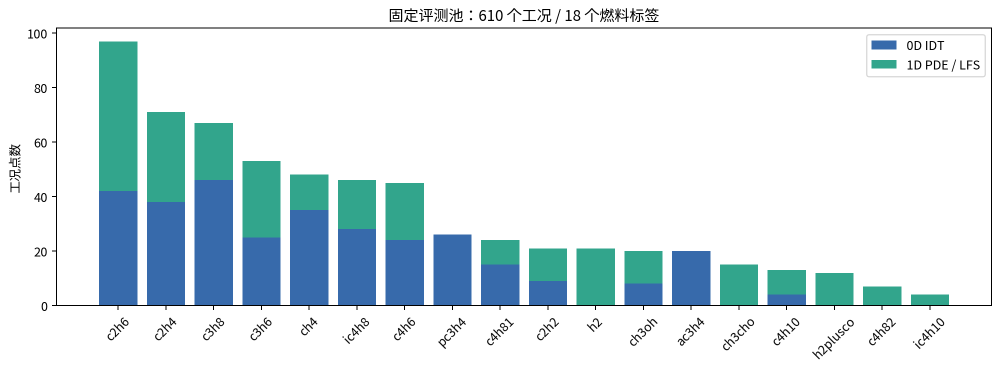
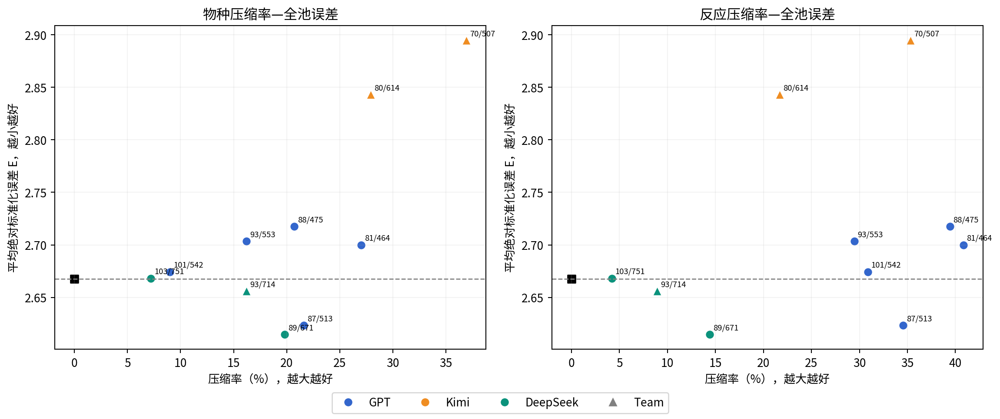
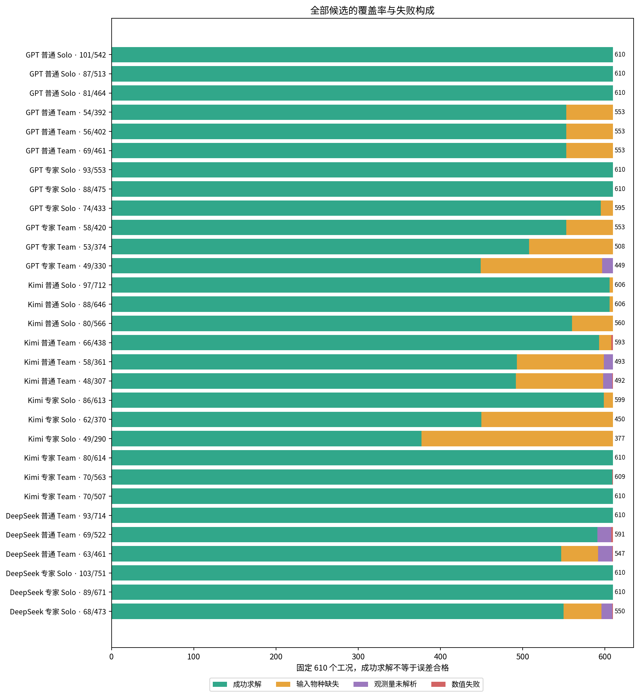
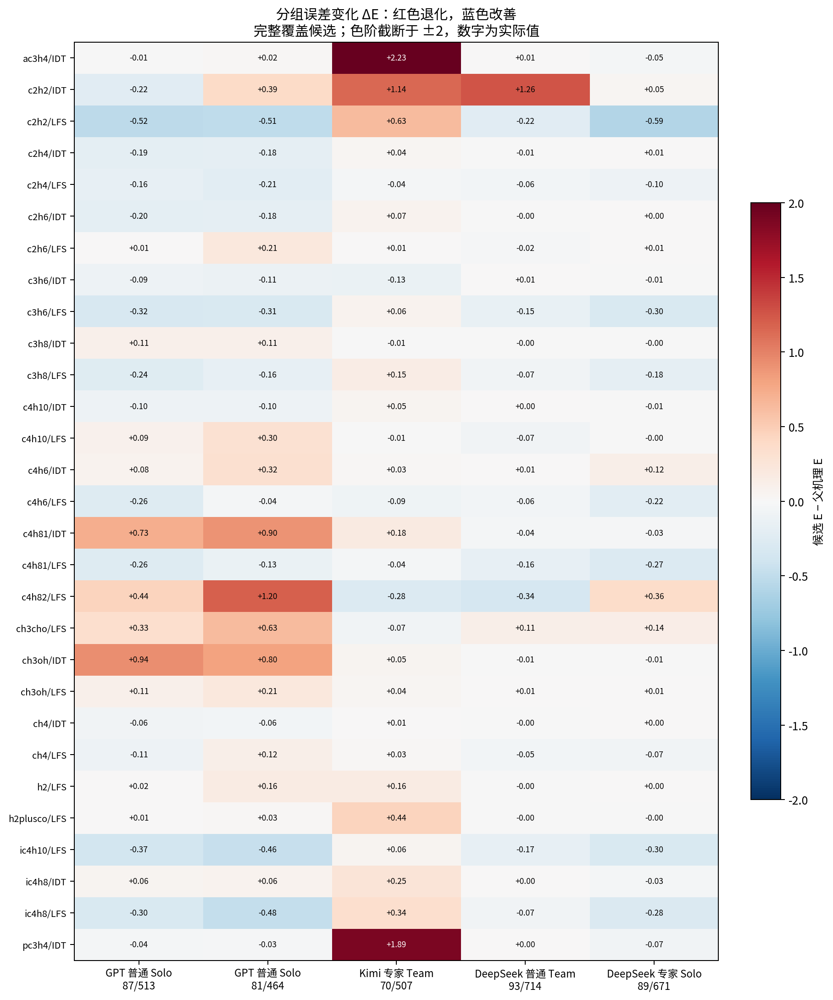

# 自主化学机理压缩：理论框架、实验结果与失败模式

## 截至 2026 年 9 月 16 日的研究滚动报告

版本：v1.0｜用途：飞书研究文档 / 团队讨论 / 论文证据整理｜状态：内部实证工作稿，不是已审定论文结论。

数据快照：2026-09-16T13:15:10.014106+00:00。本轮只核对、汇总已经产生的结果，没有新启动科学计算或付费模型评审。

阅读建议：先看第 1、5、6 节了解结论；第 7–10 节用于专家复盘；第 12–14 节界定论文能说什么、还缺什么。全部候选、逐工况误差和来源索引随文提供。

## 1. 一页结论：现在究竟做成了什么

**已经做成：Agent 可以从 USC-II 父机理出发，自行组织简化方法与验证，并输出在独立统一评测中保持完整覆盖的压缩机理。但“能压缩”与“能可靠地定义适用域、验证自己、持续进化”是不同层次的能力。后几项仍是当前短板。**

当前主实验包含 GPT + Codex、Kimi + Kimi Code、DeepSeek + Codex 三种模型与 Harness 组合，每种又分普通 / 专家任务提示、Solo / Team，共 12 个实验单元。它们是探索性单次轨迹，不是 12 次同条件重复。

本次核实了 10 组的终点评分，共 30 个非父机理候选、18,300 条候选×工况记录。每个候选均对同一 610 工况登记结果；其中 10 个候选成功求解全部 610 工况。另两组 DeepSeek 轨迹尚无可确认终点，不能填零分，也不能假定已经完成。

值得优先讨论的四个结果：

1. **目前完整覆盖候选中，最低全池平均误差来自 DeepSeek 专家 Solo：89 物种 / 671 反应，E = 2.6146。** 相比父机理 111 / 784、E = 2.6677，物种减少 19.82%，反应减少 14.41%，E 下降约 1.99%。这是数值结果，不是统计显著性结论，也不是整体性价比冠军。
2. **GPT 普通 Solo 的 87 / 513 是另一种很有竞争力的折中：E = 2.6232，物种减少 21.62%，反应减少 34.57%。** 它比上述 DeepSeek 候选更小，但全池 E 略高。不存在不定义偏好就唯一成立的“最优机理”。
3. **完整覆盖候选中，物种最少的是 Kimi 专家 Team 的 70 / 507：E = 2.8948。** 物种减少 36.94%，代价是 E 相对父机理增加约 8.51%。这里的 8.51% 是标准化平均误差这个指标的相对变化，不是“所有预测偏差 8.51%”。
4. **20 / 30 个候选未实现完整覆盖。** 很多失败来自输入燃料物种被删，也有数值求解失败、点火观测量未解析。它们可能适合自己声明的窄域，但不能据此声称适合这套完整跨工况评测域。

当前最稳妥的研究解释不是“哪家模型一定更强”，而是：**自主科研 Agent 已能完成方法实现和局部验证，但其适用域定义、证据覆盖和最终停止判断经常没有与宏观任务目标一致。更多检索、更多算例、更多子 Agent，本身都不能保证这一点。**

## 2. 科学问题：为什么不是普通代码生成

### 2.1 任务对象与下游价值

一个化学动力学机理不只是一张反应清单，还包括物种、反应结构、速率表达式、热力学和输运数据。机理参与反应器 ODE 或反应流 PDE 求解；任何局部删减，都可能在不同燃料、温度、压力、当量比或观测量上产生不同后果。

本项目的实际任务是：**在物理化学与数值约束下，寻找跨工况有效的宏观误差—复杂度折中，重点实现有依据的机理压缩。** 不要求每个中间物种的瞬态都逐一复现父机理，也不要求每个工况都比父机理更准。

下游目标是降低反应流模拟中的化学计算负担，为燃烧装置设计、参数扫描、控制和不确定性分析提供可用的简化机理。物种 / 反应数减少只是复杂度代理；实际加速还受刚性、Jacobian 结构、输运和网格等影响。本轮没有测得统一的 CFD 加速比，不能由物种压缩率直接推算加速倍数。

本轮不是分子级新反应发现，也尚未覆盖真实多物理场的全部复杂性。准确说，它是面向宏观 ODE / PDE 的**自主机理压缩与适用域验证**。长期才扩展到机理修订、跨任务策略进化、二维 / 三维反应流以及 SootGEN 和专家验证。

### 2.2 形式化目标

令机理为 M，复杂度由物种数 Ns(M)、反应数 Nr(M) 分别描述；工况为 x，实验宏观观测为 y，求解器输出为 f(M, x)。

- 科学目标：减小宏观误差 E(M)，同时减小 Ns(M)、Nr(M)。
- 约束：元素守恒、机理可加载、反应与物种引用完整、适用的热力学 / 速率约束、输入兼容，以及数值求解与观测提取要求。
- 证据要求：一个候选在自己挑选的工况上表现好，不等于在统一评测域上表现好。

可以把搜索结果画成横轴压缩率、纵轴误差的图，寻找右下方的非支配点。但“覆盖不足”的候选必须额外标出，不能靠跳过困难工况得到更低的平均误差。

### 2.3 Agent 究竟负责哪一环

| 环节 | Agent 的科学决策 | 环境 / 工具的责任 |
| --- | --- | --- |
| 定义适用域 | 要覆盖哪些燃料、温压范围与观测量 | 保存任务契约，检查声明与数据来源 |
| 获取证据 | 搜索什么、信任哪些来源、缺什么证据 | 记录查询、返回内容、提取值和来源 |
| 设计方法 | 选 DRGEP、敏感性分析、恢复、拟合或自写方法 | 执行代码，提供真实求解与错误诊断 |
| 设计验证 | 哪些算例值得算、怎样分组和留作确认 | 统一单位、返回逐工况原始值、记录成本 |
| 迭代与停止 | 根据失败修改什么，何时足以提交 | 锁定候选、独立评测，不擅自改变评分 |

因此，LLM 的研究价值不只是调用一次 DRGEP，而是把“领域—数据—方法—验证—停止”组织成可靠的决策过程。成熟 Harness 提供执行与上下文能力；它不会自动替代科学任务的适用域判断。

## 3. 长期理论：RSI、状态、记忆和技能分别是什么

### 3.1 三种变化不能混为一谈

| 变化 | 例子 | 当前应如何称呼 |
| --- | --- | --- |
| 优化对象变化 | 从 111 物种删到 87 物种 | 机理搜索取得了进展 |
| 当前任务策略变化 | 发现乙炔退化后增加火焰验证、恢复相关通路 | 反馈驱动的任务内适应 |
| 可复用的优化能力变化 | 把失败转为有适用条件的验证程序，在后续独立阶段减少同类失败 | 程序经验 / 技能进化的候选证据 |

**机理变小，不自动等于 Agent 自我进化；写了一份 skill，也不自动等于以后真的更会做科研。** 要主张 RSI，至少要证明修订的策略被后续决策实际读取和使用，并在排除继承更优候选、额外计算或测试泄漏后带来收益。

长期方案中，“可进化对象”不应只限于自然语言 memory，也可以是算例选择器、验证工作流、检索策略、工具包装或技能程序。但评分器、物理不变量、凭据和权威成本账本不能由被评测 Agent 任意修改。

### 3.2 面向长程科研的知识状态

建议把状态拆成以下对象；这是研究架构的定义，不宣称每项均已实现并通过本轮消融。

| 对象 | 应保存什么 | 为什么不能只靠对话历史 |
| --- | --- | --- |
| 运行状态 | 作业、会话、预算、等待与故障状态 | 进程活着不代表科学动作在推进 |
| 原始证据库 | case 输入、求解值、误差、状态、日志、来源 | 必须完整保存且可以重新计算汇总 |
| 当前科研状态 | 候选前沿、覆盖矩阵、主要损伤、未决假设 | 模型不应每轮重读成千上万条原始结果 |
| 程序记忆 | 条件→动作、依据、反例、启用版本 | 防止把偶然补偿规律写成永久规则 |
| 技能 | 可执行的检索、构造、验证或分析程序 | 代码可复用，但仍需测试其正确性和适用域 |

对应流程应是：原始证据追加保存 → 程序精确聚合统计 → 按当前问题检索相关证据 → Agent 决策 → 执行并检验 → 提出策略修订 → 在后续预先界定的场景验证、启用或撤销。

例如，不必让模型为了定位异丁烯退化重读全部文件。程序可以给它“该候选在异丁烯 IDT 组有 28 个评测点、误差怎样变化、哪些失败”，再允许追溯每个点的原始求解与来源。聚合值由程序计算，研究假设由模型提出，两者分开。

### 3.3 本轮对 RSI 能提供什么证据

本轮保留了候选与原始记录，并观察到 Agent 自写工具、修复代码、增加验证、改变适用域等行为。但当前 Solo / Team × 提示词 × 模型实验，**不是一套已经完成的“固定程序记忆 vs 演化程序记忆”配对实验**。

早期 A / B / C 三控制器方案、从相同 M0 开始的多阶段记忆升级方案，属于不同版本的研究设计。不能把后来的成熟 Harness 跑通和本轮候选成绩，倒填为早期 C 比 B 更优的证据。当前可说“发现了值得研究的进化对象与失败模式”，尚不能说“已证明 RSI 的因果收益”。

### 3.4 动态代理、贝叶斯选点和程序记忆如何配合

此前讨论的算法思路，可以统一解释为“在有限预算下，减少对下一步决策没有帮助的计算和历史读取”。它与当前实验成绩要分开：本轮没有完成相应模块的独立消融，因此不声称下面每项都已带来收益。

第一层是动态代理模型：用已经实算的候选×工况结果估计尚未计算区域的宏观误差，并给出不确定度。它不是用 DRGEP 关联排名直接代替误差，更不能把 LLM 的自信当作校准后的后验。对于输入缺失、求解失败和域外预测，应显式建模或拒绝可靠性承诺。

第二层是主动实验设计：选择最可能改变候选排序、暴露覆盖缺口或检验研究假设的下一批计算。一个概念性的决策准则是“预期减少的决策风险 / 预期计算成本”，而不是只算预计误差最小或最快的点。早期需要覆盖探索，后期可集中确认前沿附近的候选；这种分配策略也应通过实测比较。

第三层是检索与程序记忆：把原始记录按候选、工况家族、观测、失败类型和假设索引；程序计算覆盖和损伤摘要，模型只检索当前判断所需的证据。若某种修复策略多次在预先声明的适用域奏效，再把它登记为可复用程序经验，并保留反例与撤销条件。

三者形成闭环：代理指出哪里不确定 → Agent 选择验证 / 修复动作 → 实算更新证据 → 后验与覆盖状态更新 → 对可复用策略作前瞻检验。当前允许 Agent 自己构建开发工况时，这个闭环应在其可获取的公开材料和自设计工况上运行，不得访问独立评分池来选点。

“稀疏、可识别、跨工况稳定”的记忆要求，是为了避免把局部补偿当作长期规律：少量明确动作、可定位的证据、预先写明的适用条件、后续反例检查，比“这样改通常会更好”的泛化总结更可检验。即便如此，观察性一致仍不足以单独证明反应层面的因果机制。

## 4. 实验设置：同什么、不同什么

### 4.1 模型、Harness 与组织形式

| 组合 | 主 Agent 配置（运行记录） | Team 子 Agent 配置 | 比较边界 |
| --- | --- | --- | --- |
| GPT + Codex | GPT-6 Astra / xhigh | GPT-5.5 / high，最多两个子 Agent | Team 是混合模型，不能纯归因于协作 |
| Kimi + Kimi Code | kimi-k3 / max | 同系列配置，最多三个 Agent 含主 Agent | 与 GPT 的比较同时改变模型与 Harness |
| DeepSeek + Codex | deepseek-flash / max | 同模型配置，最多三个 Agent 含主 Agent | max 是请求配置，不等于已观测到内部推理过程 |

Solo 不创建子 Agent。上表来自既有运行配置记录；本轮受本地文件系统故障影响，没有重新读取所有配置快照。终点评测文件能确认运行归属、候选、工况和评分，但本身不是模型服务请求的身份审计记录。

各单元只有一条主轨迹。模型随机性、提示词变化、修复版本、网络和算力调度都可能影响结果。不能据此形成通用模型榜单，或声称 Team 有统计显著优势。

### 4.2 普通提示和专家提示有什么差别

普通任务要求从 USC-II 出发，寻找跨工况、宏观精度可信的简化机理；不把 610 评测工况直接交给 Agent，也不预先指定一定使用 Cantera 或 DRGEP。Agent 自行查找公开材料、建立自己的测试集与方法，提交最多三个最终候选。

专家提示在普通任务上增加了一整套科研指导：参考 FFCM / SFCPD、ReSpecTh、ChemKED 等资源；追溯原始实验方法；显式定义应用域与覆盖；处理观测定义、单位和不确定度；区分方法开发和确认验证；对工具实现做对照检查；说明哪些知识改变了决策。

因此这不是“只加几个网站链接”的消融，也不是纯改写句式。它是**领域资源 + 方法学要求**的联合干预。后续若要知道到底哪项有效，需要再拆开实验。

原任务也给了 Agent 选择适用范围的空间，没有列出必须保护全部 610 工况输入燃料的硬清单。因此，缺失某类燃料可以说明对统一评测域覆盖不足，却不能不看其声明就一律定性为违背明确指令。

### 4.3 搜索与评测必须分开理解

搜索阶段：Agent 自己组织工况、文献、父机理对比和数值验证；不同轨迹看到的数据不同。它们自己的几百或上千次测试不等于评测池的 610 个实验工况，也不等于同数量的独立实验研究。

终点阶段：Agent 提交并锁定候选文件后，独立系统执行固定 610 工况。评分合同明确不把端点反馈回流到该轮搜索，不允许以此自动恢复优化。评测核时单独记账，不扣搜索预算。

固定池沿用历史的 491 开发 + 119 回查划分。该池在项目历史上已有暴露，**本报告称“固定统一终点评测”或“历史回查”，不称 pristine blind test。** 当前 Agent 没拿到池子，不会自动洗掉项目层面的历史暴露。

当前运行方案记录的搜索上限为每组 512 分配核时 / 24 小时；独立端点评测另有上限。较新的 Kimi / DeepSeek 运行取消了模型美元和调用次数硬上限。GPT 走订阅的用量不是等额现金扣款。本轮没有重新核清完整搜索成本账本，不能作费用效率排名。

## 5. Benchmark 与评分：数字到底代表什么

### 5.1 当前固定池的构成

统一父机理为 USC-II：111 物种、784 反应。池中有 610 个唯一工况 ID，18 个燃料标签，320 个点火延迟（IDT）与 290 个层流火焰速度（LFS）工况。LFS 使用一维自由传播预混火焰求解，属于 PDE 证据；不是只有零维反应器。

此前数据审计记录的范围为：IDT 温度约 1054–2005 K、压力 0.3–262.5 atm；LFS 入口温度约 295–470 K、压力 0.5–25 atm。它仍缺少低温 / RCM、芳香族评测、组分剖面、熄火、二维 / 三维和 soot 任务。不能把“18 类燃料标签”写成“覆盖全部燃烧化学”。

当前微平均中，每个工况点等权，但燃料不等权：乙烷有 97 点，异丁烷只有 4 点，权重相差 24.25 倍。全池均值必须配合燃料×观测分组结果阅读。

### 5.2 本轮真实使用的误差定义

本次从逐工况原始预测和观测字段重新计算了所有成功候选记录的 signed_sigma，并核对汇总值。实际定义为：

- IDT：signed_sigma = ln(预测 IDT / 实验 IDT) / σ_log。
- LFS：signed_sigma = (预测 LFS − 实验 LFS) / σ_absolute。
- 工况误差：e_i = |signed_sigma_i|。
- 完整全池误差：E(M) = Σ e_i / 610，仅在全部 610 工况成功时给出。
- 物种压缩率：1 − Ns / 111；反应压缩率：1 − Nr / 784。

这些 E 是按实验不确定度归一化后的无量纲误差，不是百分比。σ 的解释来自数据适配规则；如果原始来源的不确定度定义有问题，E 也会受影响。本轮核对的是“按现有规则是否算对”，不是重新证明每篇文献的 σ 解释都正确。

父机理在本池成功 610 / 610，E = 2.6677088561。父机理也会偏离实验。简化机理局部更接近实验是可能的，但既可能来自有效保留 / 修正，也可能来自误差补偿；只看均值下降不能确认因果化学改进。

### 5.3 失败怎样计入

| 状态 | 本报告解释 | 不允许的处理 |
| --- | --- | --- |
| success | 求解与观测提取成功；仍可能误差很大 | 把成功率当作精度合格率 |
| input_incompatible | 候选缺少输入混合物所需物种 | 扔掉这些点后声称全池通过 |
| unresolved_observable | 既定求解 / 时间窗口内未得到合格观测量 | 直接认定实验错误或物理上永不点火 |
| numerical_failure | 求解器 / 数值过程失败，需读取诊断 | 一律归因于机理质量或模型智力 |

只要不完整，全池 E 就记为“—”，另存成功子集均值与覆盖率。本报告没有擅自给失败工况补 0，也没有根据本轮结果新设处罚常数。

此前提出“压缩与误差 6:4”的 grader 想法，不代表已有唯一冻结的标量奖励。本轮原始评分仍报告误差、复杂度和覆盖，**没有为了得到一个总冠军而后加权重**。

### 5.4 评测一致性与剩余风险

本次核对的 10 个有效端点，其工况内容的规范化校验值一致，科学适配器的 source pins 一致，记录的求解器均为 Cantera 3.0.1。所有 30 个候选均有 610 个唯一的结果记录；成功数、逐点误差和汇总均值已重新计算核对。

这证明了当前表格采用一致的计算对象和指标实现，但不等于实验观测算子绝对正确。已有审计还提出：不同火焰实验技术映射为统一 FreeFlame 观测的合理性、文献不确定度语义、跨页面实验批次归并等需要继续核实。源数据中的 campaign_group 仍有待完成文献组件映射。

不能因为父机理在某些点有 14–17σ 的大误差，就事后删点；也不能把求解窗口导致的未解析当成可随意剔除的坏数据。

## 6. 全部实验结果

### 6.1 12 组状态矩阵

| 模型 + Harness | 任务 | 模式 | 完整候选 / 已评分候选 | 状态 |
| --- | --- | --- | --- | --- |
| GPT + Codex | 普通 | Solo | 3 / 3 | 终点评分完成 |
| GPT + Codex | 普通 | Team | 0 / 3 | 终点评分完成 |
| GPT + Codex | 专家 | Solo | 2 / 3 | 终点评分完成 |
| GPT + Codex | 专家 | Team | 0 / 3 | 终点评分完成 |
| Kimi + Kimi Code | 普通 | Solo | 0 / 3 | 终点评分完成 |
| Kimi + Kimi Code | 普通 | Team | 0 / 3 | 终点评分完成 |
| Kimi + Kimi Code | 专家 | Solo | 0 / 3 | 终点评分完成 |
| Kimi + Kimi Code | 专家 | Team | 2 / 3 | 终点评分完成 |
| DeepSeek + Codex | 普通 | Solo | 0 / 0 | 本轮无终点结果；主进程等待 Ceph |
| DeepSeek + Codex | 普通 | Team | 1 / 3 | 终点评分完成 |
| DeepSeek + Codex | 专家 | Solo | 2 / 3 | 终点评分完成 |
| DeepSeek + Codex | 专家 | Team | 0 / 0 | 本轮无终点结果；主进程等待 Ceph |

DeepSeek 普通 Solo、专家 Team 的主进程在本轮检查时处于 Ceph 元数据等待，远端没有本项目运行中的 Slurm 作业。这里只报告“未核实终点 + 基础设施阻塞”，不推断其主动停止原因，也不对其候选补造结果。

### 6.2 30 个候选的统一成绩

“未成功”三列依次为：输入不兼容 / 观测量未解析 / 数值失败。所有候选都有 610 条状态记录；“—”不是遗漏记录，而是不具备完整全池均值。

| 实验组 | 物种/反应 | 物种/反应压缩率 | 成功/610 | 全池 E | 未成功：输入/未解析/数值 |
| --- | --- | --- | --- | --- | --- |
| GPT 普通 Solo | 101/542 | 9.0% / 30.9% | 610 | 2.6744 | 0/0/0 |
| GPT 普通 Solo | 87/513 | 21.6% / 34.6% | 610 | 2.6232 | 0/0/0 |
| GPT 普通 Solo | 81/464 | 27.0% / 40.8% | 610 | 2.7000 | 0/0/0 |
| GPT 普通 Team | 54/392 | 51.4% / 50.0% | 553 | — | 57/0/0 |
| GPT 普通 Team | 56/402 | 49.5% / 48.7% | 553 | — | 57/0/0 |
| GPT 普通 Team | 69/461 | 37.8% / 41.2% | 553 | — | 57/0/0 |
| GPT 专家 Solo | 93/553 | 16.2% / 29.5% | 610 | 2.7035 | 0/0/0 |
| GPT 专家 Solo | 88/475 | 20.7% / 39.4% | 610 | 2.7174 | 0/0/0 |
| GPT 专家 Solo | 74/433 | 33.3% / 44.8% | 595 | — | 15/0/0 |
| GPT 专家 Team | 58/420 | 47.7% / 46.4% | 553 | — | 57/0/0 |
| GPT 专家 Team | 53/374 | 52.3% / 52.3% | 508 | — | 102/0/0 |
| GPT 专家 Team | 49/330 | 55.9% / 57.9% | 449 | — | 148/13/0 |
| Kimi 普通 Solo | 97/712 | 12.6% / 9.2% | 606 | — | 4/0/0 |
| Kimi 普通 Solo | 88/646 | 20.7% / 17.6% | 606 | — | 4/0/0 |
| Kimi 普通 Solo | 80/566 | 27.9% / 27.8% | 560 | — | 50/0/0 |
| Kimi 普通 Team | 66/438 | 40.5% / 44.1% | 593 | — | 15/0/2 |
| Kimi 普通 Team | 58/361 | 47.7% / 54.0% | 493 | — | 106/11/0 |
| Kimi 普通 Team | 48/307 | 56.8% / 60.8% | 492 | — | 106/11/1 |
| Kimi 专家 Solo | 86/613 | 22.5% / 21.8% | 599 | — | 11/0/0 |
| Kimi 专家 Solo | 62/370 | 44.1% / 52.8% | 450 | — | 160/0/0 |
| Kimi 专家 Solo | 49/290 | 55.9% / 63.0% | 377 | — | 233/0/0 |
| Kimi 专家 Team | 80/614 | 27.9% / 21.7% | 610 | 2.8430 | 0/0/0 |
| Kimi 专家 Team | 70/563 | 36.9% / 28.2% | 609 | — | 0/0/1 |
| Kimi 专家 Team | 70/507 | 36.9% / 35.3% | 610 | 2.8948 | 0/0/0 |
| DeepSeek 普通 Team | 93/714 | 16.2% / 8.9% | 610 | 2.6560 | 0/0/0 |
| DeepSeek 普通 Team | 69/522 | 37.8% / 33.4% | 591 | — | 0/17/2 |
| DeepSeek 普通 Team | 63/461 | 43.2% / 41.2% | 547 | — | 45/17/1 |
| DeepSeek 专家 Solo | 103/751 | 7.2% / 4.2% | 610 | 2.6682 | 0/0/0 |
| DeepSeek 专家 Solo | 89/671 | 19.8% / 14.4% | 610 | 2.6146 | 0/0/0 |
| DeepSeek 专家 Solo | 68/473 | 38.7% / 39.7% | 550 | — | 46/13/1 |

GPT 普通 Solo / Team 最初的端点因机理文件接入格式被判 invalid_mechanism，随后完成了 bulk_v1 修复评测。上表使用修复后的真实求解结果，原始失败文件仍保留；不能把最初的格式接入错误当成这六个机理都没有科学有效性。修复评测复用了代码发布包，运行归属依据原端点合同确定，不依据共享代码目录猜测。

### 6.3 只比较完整覆盖的候选

| 实验组 | 物种/反应 | 全池 E | 相对父机理 E 变化 | 物种压缩率 | 反应压缩率 |
| --- | --- | --- | --- | --- | --- |
| DeepSeek 专家 Solo | 89/671 | 2.6146 | -1.99% | 19.82% | 14.41% |
| GPT 普通 Solo | 87/513 | 2.6232 | -1.67% | 21.62% | 34.57% |
| DeepSeek 普通 Team | 93/714 | 2.6560 | -0.44% | 16.22% | 8.93% |
| DeepSeek 专家 Solo | 103/751 | 2.6682 | +0.02% | 7.21% | 4.21% |
| GPT 普通 Solo | 101/542 | 2.6744 | +0.25% | 9.01% | 30.87% |
| GPT 普通 Solo | 81/464 | 2.7000 | +1.21% | 27.03% | 40.82% |
| GPT 专家 Solo | 93/553 | 2.7035 | +1.34% | 16.22% | 29.46% |
| GPT 专家 Solo | 88/475 | 2.7174 | +1.86% | 20.72% | 39.41% |
| Kimi 专家 Team | 80/614 | 2.8430 | +6.57% | 27.93% | 21.68% |
| Kimi 专家 Team | 70/507 | 2.8948 | +8.51% | 36.94% | 35.33% |

图中只画完整覆盖候选。不同颜色代表模型 + Harness 组合，圆点为 Solo、三角为 Team；标注为物种数 / 反应数。虚线是父机理 E。此图是已提交候选的观察性对比，不是已找到真实全局 Pareto 前沿。

三个不同偏好的例子：

- 若优先最低平均 E：当前是 DeepSeek 专家 Solo 89 / 671。
- 若希望明显降低反应数且 E 不高于父机理：GPT 普通 Solo 87 / 513 很有竞争力。
- 若优先减少物种并愿意承担一定 E 退化：Kimi 专家 Team 70 / 507 给出更小的物种集合。

因为第三个候选反应数 507 与 GPT 的 513 接近，但误差更高，不能只依据“70 比 87 小”就说它在所有复杂度指标上大幅领先。

### 6.4 失败不是边角问题

几个典型例子：

- GPT 普通 Team 的三个候选均为 553 / 610：删除 iC4H8、iC4H10、C4H82，失去 46 + 4 + 7 个工况。
- Kimi 普通 Solo 的 97 / 712、88 / 646 都是 606 / 610：全量结果已完成，不再是“仍在计算”；少量输入缺失仍阻止给出全池 E。其最终第三个提交实际为 80 / 566，以终点文件为准，不采用早期计划中的候选计数。
- Kimi 专家 Solo 的三个候选分别覆盖 599、450、377 个工况，逐步压缩也逐步缩小统一评测域覆盖。
- Kimi 专家 Team 的 70 / 563 是 609 / 610，只有一个数值失败。它与大量删燃料导致的失败应分别讨论；不能因差一个点就忽略状态，也不能据此断言其普遍不可用。
- DeepSeek 普通 Team 的 69 / 522 没有输入不兼容，但有 17 个未解析和 2 个数值失败。仅保护全部输入物种，还不够保证动态预测完整。

### 6.5 分组误差：均值好在哪里，又坏在哪里

图中每格是候选与父机理在同一个燃料×观测组上的 E 差值。蓝色改善，红色退化。色阶为了可读性截断在 ±2；格内数字没有截断。

DeepSeek 89 / 671 的总均值改善，并非所有组都改善。主要有利贡献包括丙烯 LFS、乙炔 LFS、异丁烯 LFS；丁二烯 IDT、2-丁烯 LFS、乙醛 LFS 仍有退化。

GPT 87 / 513 的改善主要来自丙烯 LFS、乙烷 IDT、乙烯 IDT；1-丁烯 IDT 和甲醇 IDT 是值得单独检查的损伤项。

Kimi 70 / 507 相对父机理的全池 E 增加约 0.2271。其中 pC3H4 与 aC3H4 的 IDT 两组分别贡献约 +0.0805、+0.0731，合计约占净增加的 67.6%。这提供了具体诊断目标：不是笼统地说“所有火焰都变差”，而是先检查 C3H4 异构体相关的点火表现。该分解是误差统计贡献，不是已证明损伤由某条反应引起。

### 6.6 历史 491 / 119 划分上的表现

| 实验组 | 物种/反应 | 原开发 491：E | 历史回查 119：E |
| --- | --- | --- | --- |
| GPT 普通 Solo | 101/542 | 2.6151 | 2.9192 |
| GPT 普通 Solo | 87/513 | 2.5586 | 2.8898 |
| GPT 普通 Solo | 81/464 | 2.6344 | 2.9706 |
| GPT 专家 Solo | 93/553 | 2.6544 | 2.9062 |
| GPT 专家 Solo | 88/475 | 2.6655 | 2.9317 |
| Kimi 专家 Team | 80/614 | 2.8221 | 2.9296 |
| Kimi 专家 Team | 70/507 | 2.8572 | 3.0500 |
| DeepSeek 普通 Team | 93/714 | 2.5761 | 2.9858 |
| DeepSeek 专家 Solo | 103/751 | 2.6118 | 2.9009 |
| DeepSeek 专家 Solo | 89/671 | 2.5472 | 2.8927 |

父机理在原开发 491 点的 E 为 2.6115，在历史回查 119 点为 2.8995。当前自主 Agent 并不是把这 491 点作为统一显式训练输入；这里保留划分只是为了诊断历史分布，不把它解释成标准 train/test 学习曲线。

例如 DeepSeek 普通 Team 93 / 714 在全 610 点上略优于父机理，但在历史 119 点上为 2.9858，反而高于父机理 2.8995。这个反例说明，全池净收益仍可能掩盖某个分布上的退化。

## 7. 决策轨迹复盘：方法到底做了什么

本节区分证据等级：**终点成绩为本轮读取远端原始文件重新核对；下列过程叙述主要来自先前已记录的轨迹审计，本轮没有因文件系统阻塞而重新逐条读取所有 transcript。** 它们是复盘线索，不能冒充完整的逐步因果证明。

可供专家分析的是公开输出的理由、检索与工具 I/O、代码和行动顺序，不是模型未公开的内部思维链。没有留下记录的搜索关键词或“为什么”不应事后补写成模型原话。

### 7.1 普通版 GPT：Solo 与 Team 都走了 DRGEP 类路线

| 环节 | Solo 的已记录行为 | Team 的已记录行为 | 专家解释 |
| --- | --- | --- | --- |
| 方法选择 | 自行选择并实现 DRGEP 类筛选 | 同样采用 DRGEP 类筛选，再做候选验证 / 调整 | Team 更小不意味着用了完全不同、更先进的方法 |
| 初始覆盖 | 记录了更宽的燃料范围，约 60 个建图训练工况 | 建图工况约 99 个，但燃料范围更窄 | 点数更多不代表领域覆盖更广 |
| 进一步删减 | 直接删减敏感性 / 恢复，记录约 45 个 IDT 筛查点与 63 次单物种删除试验 | 记录约 24 个 IDT 哨兵点 | 关键区别可能在验证覆盖和决策规则，而不只是图排名 |
| 外部统一评测 | 3 个候选均成功 610 / 610 | 3 个候选均为 553 / 610 | 大幅压缩的一部分来自舍弃统一评测需要的燃料 |

两个系统都选 DRGEP，说明它是模型容易识别和实现的常见路线，但轨迹没有证明它们系统比较过所有替代方法再得出最优选择。检索 DOI / Crossref 元数据，也不能自动等同于读完原文方法与适用条件。

### 7.2 专家版 GPT Solo：方法检查更细，但终点没有整体更强

已有轨迹记录包括：更显式地组织多燃料验证、将开发与确认测试分开、做工具一致性检查、通过直接删减和联合验证发现损伤，并恢复相关结构。例如恢复 H2C4O 相关结构用于修复乙炔表现。

这些行为在方法学上有价值，但本轮终点 93 / 553、88 / 475 的 E 均略高于普通 Solo 的 87 / 513；74 / 433 又缺失乙醛工况。**更专业的流程不必然在单次运行里产生更好的精度—压缩折中。** 原因可能涉及预算使用、覆盖分配、保守程度、随机轨迹与工具差异，不能只凭结果反推某一步一定错误。

### 7.3 Kimi：Team 的局部验证与覆盖边界都值得看

Kimi 普通 Solo 曾设计较大的自验证网格；这体现它愿意计算，但仍在最终统一评测缺失输入燃料。自验证调用数很大，只能证明做了这些验证，不能证明已经覆盖目标领域。

Kimi 专家 Solo 的轨迹中出现主动缩小到 C0–C3 / C0–C1 等应用范围的选择；它可以产生对该窄域有意义的机理，但与统一 18 标签评测的覆盖要求不等价。

Kimi 专家 Team 有修改跨工况聚合 / 排名和自写工具的记录，最终得到 80 / 614 和 70 / 507 两个完整覆盖候选。这是正面能力证据。另一方面，改成 mean 或 maximin 一类聚合，并不自动等于标准 DRGEP 或理论更优；要看数学定义、实现对照和跨工况实算。

### 7.4 DeepSeek：新的终点结果修正了“只会折腾”的简单判断

现在已确认专家 Solo 的 89 / 671、普通 Team 的 93 / 714 都在固定 610 点上得到完整结果，且均值低于父机理。不能继续沿用早期运行尚未结束时“DeepSeek 没有做出有效优化”的判断。

同时，专家 Solo 的 68 / 473 和普通 Team 更激进的两个候选失去完整覆盖。合理解释是：这两条轨迹找到了一定有效压缩区间，但进一步压缩的外部可靠性不足。

本轮尚未完整重读这两条新完成轨迹的公开 rationale 和代码修订顺序，因此不猜测 89 / 671 的具体决策为什么成功，也不把它归为已经验证的 RSI 收益。

## 8. 深层失败模式：不是简单的“模型笨”

| 失败模式 | 可观察表现 | 深层结构原因 / 解释假设 | 应怎样验证或改进 |
| --- | --- | --- | --- |
| 用缩小领域代替跨工况压缩 | 小候选删掉整类输入燃料 | 优化目标中的“更小”明确，但适用域约束没有贯穿决策 | 显式记录声明域、证据域、评测域三者的差异 |
| 把算例数量当成覆盖 | 自建上千点仍漏掉某个燃料家族 | 在熟悉区域密集采样，缺少覆盖矩阵与未验证区域提示 | 记录燃料×观测×温压范围，而不只计调用数 |
| 检索到资源但没有用于决策 | 找到数据库 / DOI 后只摘少量点 | 以“找到材料”替代“材料支撑什么选择” | 保存查询、重要返回知识、行动影响和原始定位 |
| 自验证与自设计共享盲区 | 验证全部来自同一窄域或同一错误工具 | 设计者和检查者继承同一假设 | 独立定义确认覆盖；检查方法实现的基准样例 |
| 更改排名却没有验证数学含义 | 换聚合方式后排名更有区分度 | 把数值变化当成方法正确或更有科学意义 | 小图解析例 + 成熟接口对照 + 实际保留集合比较 |
| 以工作流结束作为停止证据 | 完成脚本、报告和候选导出就提交 | 缺少显式的未解决科学风险表 | 提交前核对仍缺哪些域、误差风险和反例 |
| 子 Agent 放大共同假设 | 文献、代码和测试子任务都只覆盖主 Agent 指定的小域 | 并行化不等于独立审查，主 Agent 的范围决定影响全队 | 增加互补覆盖 / 质疑职责，并做消融，不先假定有效 |
| 把基础设施等待算成模型慢 | 有心跳但工具请求排队，或 Ceph 等待 | 运行状态与科学进度指标混用 | 分开记录模型等待、工具排队、计算、I/O 与故障 |

表中“深层原因”是由行为与架构提出的机制解释，不是已经通过干预实验验证的因果关系。最终论文应把可直接观察的事实与解释假设分开。

## 9. 已发现的工具与工程问题，以及它们能解释多少结果

### 9.1 DRGEP 图路径的零权边问题

此前独立审计发现，某个自写实现把关联值 r 转为 −log(r)，当 r = 1 时得到零权边；使用特定稠密最短路接口时，零被当成无边，导致关联传播错误。三节点例 A→B = 1、B→C = 0.8，正确关联应为 1、1、0.8，旧实现可能给出 1、0、0。显式稀疏边表示可以避免这类歧义。

但“发现 bug”不等于“它解释了最后所有成绩”。先前记录的实际轨迹回放中，部分排名改变，相关直接阈值保留集合却没有同步改变；某些进一步删除也已被实算拒绝。因此，不能把 Solo / Team 的最终机理大小差异全部归因于这一 bug。

### 9.2 工具请求被通知与账本操作阻塞

历史实现曾对大量普通流式通知也重复执行预算 / 契约检查和父子账本事务，读取还申请写锁。结果可能是模型已经提出动作，但工具很久才开始执行；心跳仍更新，看起来“活着”。

这属于调度 / 数据访问设计缺陷，不是模型持续思考了几十分钟。后续修复方向是通知快速消费、按时间节流心跳，在真正付费操作、科学提交和状态变化处严格记账。精确到每一分钟的数据库、通知队列和文件系统占比没有完成测量，不能凭估计写入速度结论。

### 9.3 本轮遇到的 Ceph 阻塞是另一件事

报告编写时，项目目录读操作超时，两条未确认完成的 DeepSeek 主进程等待 Ceph 元数据。远端已有的终点文件仍能通过 SSH 读取，所以本报告取回远端证据并在本地非 Ceph 目录生成。

本轮没有取消、重启或修改这些研究轨迹。没有重新将报告写回受阻塞的 PROJECT_STATUS.md / DECISION_LOG.md；待同步的状态说明单独保存。此故障不应归入 Agent 的科学决策失败，也不能被报告的成功生成掩盖。

### 9.4 复现记录应该保留什么

对每次行动，理想的可复盘记录应是：当时可见状态 → 公开理由 / 假设 → 查询关键词或工具参数 → 实际返回 → 提取出的关键知识 → 下一动作 → 验证与未决问题。只保存最终总结或源码不足以复盘。

当前已有 transcript / 终点结果等证据路径，但不能声称捕获了模型服务的隐藏提示或私有思维链。本报告不补造缺失 I/O，不把人工事后解释包装成 Agent 当时的思考。

## 10. 成本与效率：目前能核实到什么程度

下表来自本轮只读查询 Slurm 的分配记录，核时 = 分配核数 × 作业墙钟时间。它是**独立终点评测的节点占用**，不是 Agent 搜索成本，也不是实际进程 CPU。全部对应 64 核分配。

| 实验组 | Job | 节点墙钟分钟 | 分配核时（独立评测） |
| --- | --- | --- | --- |
| GPT 普通 Solo | 7950591 | 17.55 | 18.72 |
| GPT 普通 Team | 7950590 | 7.80 | 8.32 |
| GPT 专家 Solo | 7952916 | 26.07 | 27.80 |
| GPT 专家 Team | 7952114 | 18.65 | 19.89 |
| Kimi 普通 Solo | 7955465 | 27.90 | 29.76 |
| Kimi 普通 Team | 7954669 | 19.75 | 21.07 |
| Kimi 专家 Solo | 7954173 | 20.55 | 21.92 |
| Kimi 专家 Team | 7953925 | 25.27 | 26.95 |
| DeepSeek 普通 Team | 7958655 | 25.32 | 27.00 |
| DeepSeek 专家 Solo | 7958608 | 29.73 | 31.72 |

GPT 普通版的表中作业是修复后的候选评测；初始失败评测与父机理计算也实际消耗过资源，不能把上表当完整成本总账。其他重试、本地后处理、模型费用、搜索作业、排队和会话停顿也没有全部纳入此表。

因此，当前可以比较候选科学表现，**不能严谨地给出“GPT 比 DeepSeek 快多少倍”“Team 更省多少钱”**。要回答效率问题，需要从权威账本重建：搜索计算 / 独立评测 / 模型 token 或订阅估算 / 基础设施故障 / 排队 / 真正决策时间。

## 11. 和更早的人类基线、评分提案有什么关系

### 11.1 Wang 56 / 428 的历史对照

项目更早曾将原生 Astra 的 51 / 49 / 46 物种候选，与文献 Wang 56 物种 / 428 反应机理对齐。这不是当前 12 组提示词 / Team 实验，不能直接并入本报告的统一候选榜单。

此前记录过一个重要现象：在旧的共同成功开发子集上，51 物种候选明显优于 Wang；到共同成功历史回查子集，排序反转。历史摘要记录为：开发 486 点，Wang E ≈ 6.3305、51 物种 E ≈ 2.8132；回查 118 点，Wang ≈ 3.2901、51 物种 ≈ 3.8811。**这段是历史记录摘要，本轮因存储阻塞未重取旧原始文件，不作为新增核实结果，也不与当前 610 点 E 直接比较。**

当时“按回查的燃料×观测比例重加权，开发优势几乎消失”的含义是：保持每个组内部的开发误差不变，只把各组的权重改成回查分布，查看总分是否改变。它提示领域组成可能解释一部分排名变化；不等于改了原始实验值，也不独自证明过拟合或某种模型因果缺陷。重加权不能创造开发中没有的组或未测反应区域。

若要把“超过人类简化机理”作为当前论文主结论，必须重新锁定同一任务域、观测算子、候选版本与完整评分，并核清该文献机理原本为哪些燃料和应用设计。不能用广域任务处罚窄域文献机理后直接宣称人类方法落后。

### 11.2 Rubric 与定量 grader

已有辅助科研评审设计包括 Taste、Methodology、Novelty、Solid、Robust，以及 Agent 决策质量，建议按 0–4 / NA 给出基于证据的评价。它应读真实端点结果与过程证据，而非只读 Agent 自己的报告。

但本轮未核实完整的既有 rubric 评分产物，也没有新增付费 LLM-as-judge 调用，因此这里不编造六维分数；“本轮没有核实”不等于断言之前从未执行评审。Rubric 是探索性辅助，不替代统一误差、压缩率和覆盖率的客观结果。

## 12. 目前哪些结论可写，哪些不能写

| 命题 | 当前证据判断 | 边界 |
| --- | --- | --- |
| Agent 能自主产生有用的 USC-II 简化候选 | 有终点实算支持 | 限于本任务与已观察轨迹，不代表普遍成功 |
| 已得到完整 610 覆盖、误差略优于父机理的压缩机理 | 有支持：GPT 87/513、DeepSeek 89/671 与 93/714 | 是当前均值结果，缺少重复和显著性分析 |
| 大幅物种压缩常伴随覆盖或误差损失 | 本批候选存在明确实例 | 不是对所有方法的理论下界 |
| Team 一定优于 Solo | 不支持 | GPT 与 Kimi 的方向不同，且 GPT 是混合模型团队 |
| 专家提示一定提高结果 | 不支持 | Kimi Team 有正例，GPT 没有统一增益 |
| 更大量的自验证等于更充分的跨工况覆盖 | 不支持 | 多个候选遗漏了固定池输入域 |
| 已证明 RSI / memory / skill 进化有效 | 尚不支持 | 缺少明确版本干预、后续验证与配对对照 |
| 已超过人类最优简化方法 | 尚不支持 | 旧 Wang 对照有任务域和分布边界，未纳入当前统一比较 |
| 在 PDE 上有证据 | 有一维 LFS 证据 | 不等于二维 / 三维反应流、旋流或 soot 证据 |
| 可以评出模型 / Harness 的普遍优劣 | 不支持 | 模型与 Harness 混淆、单次轨迹、成本与故障未完整控制 |

上述“有支持”均指内部工作稿可描述的观察，不代表已经通过项目审查晋升为论文主张。主要论文结论仍需专家 review。

## 13. 当前最值得写成论文的问题

本轮可以围绕一个收敛的实证问题组织论文：

**自主科学 Agent 能否在自行设计验证数据的情况下，实现跨工况可靠的化学机理压缩？其局部成功为什么不能自动转化为广域可靠性？**

潜在结构如下：

1. 问题与价值：宏观反应动力学的多目标压缩，难点不是只写一个优化器，而是定义和维护证据覆盖。
2. 环境与任务：父机理、公开信息获取、Agent 自建验证、统一独立评测；区分搜索与终点核时。
3. 对照：三种模型 / Harness 组合，普通 / 专家提示，Solo / Team；清楚承认探索性设计的混淆因素。
4. 结果：完整报告候选复杂度、误差、覆盖和失败；以分组热图解释均值，而不是只展示一个最优点。
5. 过程分析：任务域替换、数量替代覆盖、检索不落地、自验证共同盲区、停止判断。
6. 局限与下一步：文献观测算子复核、重复轨迹、成熟底座上的覆盖 / 记忆策略干预，以及真正的 RSI 后续阶段检验。

这份材料更接近“能力与评价边界”的实证工作稿。把它提升为 RSI 算法论文，还需要独立的算法干预与因果证据，不能仅改标题。

## 14. 下一步主线、审查点与数据使用说明

### 14.1 本轮不扩展出题、不启动新实验

用户已暂停出题。本次产物只整理理论、实验和证据，不生成新的合成训练集，不改变评分，不重新开放历史回查反馈，也不向外部人员或飞书空间自动发布。

### 14.2 按优先级收尾

1. 文件系统恢复后，同步本报告并核清剩余两条 DeepSeek 的终止状态、完整成本与关键 transcript；保留故障和恢复版本，不能抹掉失败记录。
2. 补齐当前模型身份 / 任务快照与最终候选之间的索引；把已知的过程审计转成可逐条定位的中文专家复盘。
3. 完成 benchmark 中观测定义、实验批次和不确定度语义审计。若要改变冻结评分规则，先记录理由并提交专家审查，不能依据成绩删点。
4. 若继续做算法创新，优先检验“覆盖驱动的验证与停止”或“可验证的程序记忆”中的一个变量；保持模型、任务和评测一致，做配对重复。此处是建议，不是本轮新授权运行。

### 14.3 大图景位置

长期路线为：living mechanism 问题定义 → benchmark → Agent / RSI 算法证据 → 规模化 PDE → 少量 3D 迁移 → SootGEN / 专家合作验证 → 投稿。

当前处于 **benchmark 与成熟 Harness 强基线的实证整理阶段**，已经有一维 PDE 终点评测，尚未进入可宣称 RSI 成功或多维反应流泛化的阶段。当前材料的价值，是把“系统能跑”“候选更小”“科学可靠”“策略进化”拆开，避免以后用工程成功代替科学结论。

### 14.4 证据与文件说明

- 报告正文、表格和图均可导入 / 复制到飞书；未声称已经创建在线飞书文档。
- `candidate_results.csv`：30 个候选的复杂度、覆盖、误差、分位数和来源。
- `case_results.csv`：18,300 条候选×工况结果。失败保留状态，不补造误差。
- `fuel_observable_results.csv`：燃料×观测分组误差与覆盖。
- `results.json`：机器可读汇总、验证记录、运行归属和原始证据路径。
- `evidence/`：从远端终点评测读取的 JSON 证据快照，包括保留的旧接入失败版本；不是完整 Agent transcript。
- `figures/`：可直接放入文档的四幅静态图。
- `PENDING_PROJECT_UPDATES.md`：Ceph 恢复后应同步的状态与决策记录，本轮未假装已经写回项目。

为避免阅读正文被路径打断，完整来源映射与运行 ID 在附录及 JSON 中提供。证据快照是读取后格式化保存的 JSON，保留语义与字段；不是声称远端文件逐字节原样复制。附带校验值用于记录本次产物，不代表证明历史从未被修改。

## 附录 A：固定池燃料分布

| 燃料标签 | 工况数 |
| --- | --- |
| c2h6 | 97 |
| c2h4 | 71 |
| c3h8 | 67 |
| c3h6 | 53 |
| ch4 | 48 |
| ic4h8 | 46 |
| c4h6 | 45 |
| pc3h4 | 26 |
| c4h81 | 24 |
| c2h2 | 21 |
| h2 | 21 |
| ch3oh | 20 |
| ac3h4 | 20 |
| ch3cho | 15 |
| c4h10 | 13 |
| h2plusco | 12 |
| c4h82 | 7 |
| ic4h10 | 4 |

## 附录 B：运行与端点评测来源映射

| 实验组 | 运行目录 | 远端评测目录 / Job |
| --- | --- | --- |
| GPT 普通 Solo | solo-20260915T131056.265011Z-108d5c07 | cfx_astra_3a9fcc9a572e45bfb6a6fcb6_endpoint_bulk_v1 / 7950591 |
| GPT 普通 Team | team-20260915T131059.107037Z-e89a0b43 | cfx_astra_ca02e2d6c3b1457f9b99bb1a_endpoint_bulk_v1 / 7950590 |
| GPT 专家 Solo | expert-v2-solo-20260915T173616.942323Z-0bbd299d | cfx_astra_eaab23cebb934bb2ba9f69f0_endpoint / 7952916 |
| GPT 专家 Team | expert-v2-team-20260915T173617.847670Z-2c1bfc9d | cfx_astra_61bc9612470e4d46ab08ef0e_endpoint / 7952114 |
| Kimi 普通 Solo | baseline-v1-kimi-solo-20260916T010433.416187Z-99dd4120 | cfx_astra_8975b1c396724bdfaca362a1_endpoint / 7955465 |
| Kimi 普通 Team | baseline-v1-kimi-team-20260916T010434.254556Z-33182164 | cfx_astra_12fe63bc0f88475da6b6dc79_endpoint / 7954669 |
| Kimi 专家 Solo | expert-v2-kimi-solo-20260916T002108.637960Z-d26b7970 | cfx_astra_240e744073cd4af98f8d729f_endpoint / 7954173 |
| Kimi 专家 Team | expert-v2-kimi-team-20260916T002109.891728Z-d9881267 | cfx_astra_8b7403c260e04d29bdda493a_endpoint / 7953925 |
| DeepSeek 普通 Team | baseline-v1-deepseek-team-20260916T052223.858290Z-614995a1 | cfx_astra_e598e3112e8446a08ba0586d_endpoint / 7958655 |
| DeepSeek 专家 Solo | expert-v2-deepseek-solo-20260916T052223.859010Z-0831cedf | cfx_astra_f61e625cdc7842b397ddfa9c_endpoint / 7958608 |

完整远端根目录为 `/public3/home/sca2070/WORK/Caifeixue/AgenticRL_research_runs`。目录中的 `cfx_astra_` 是历史通用命名前缀，不能据此判断模型是 Astra；应依据对应轨迹与合同归属。

## 附录 C：术语速查

| 术语 | 本报告中的含义 |
| --- | --- |
| case / 工况 | 一个明确的输入、观测定义与实验目标 |
| candidate / 候选 | 一个锁定的机理文件版本 |
| candidate × case | 一个机理在一个工况上的评测记录 |
| solver invocation | 一次实际求解，重试与时间窗口扩展可能增加调用 |
| coverage | 这里是成功求解比例，不是误差低于阈值的通过率 |
| E / signed_sigma | 按实验不确定度标准化的宏观误差，不是百分比 |
| Harness | 管理模型、工具、上下文、会话与执行的底座 |
| skill / 程序记忆 | 可复用方法与其适用条件；存在文件不代表进化已有效 |
| RSI | 后续可复用的研究策略 / 能力改进，而不只是当前候选变小 |

文档结束。本文所有新增数字分析均来自已完成评测文件的后处理；没有新增求解、模型评审或未声明的实验干预。
